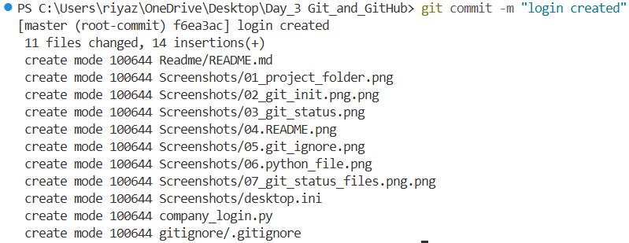
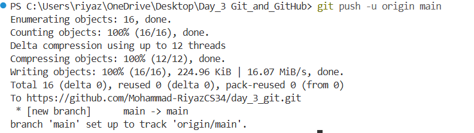

# Day 3 Git & GitHub

## Topics Covered
- Git Basics
- GitHub
- Branching
- Pull Requests
- Merge Conflicts
- .gitignore

## Overview

### Git Basics
- git init
- git status
- git add
- git commit
- git push
- git pull

### Branching
- Creating branches
- Switching branches
- Merging branches
- Deleting branches

### GitHub Workflow
- Connecting local repo to GitHub
- Pushing code to remote repository
- Pull Requests(PR)

### Additional Topics
- .gitignore
- README.md

### Commands Practiced
 ```bash
 git init
 git status
 git add .
 git commit -m "message"
 git push
 git pull
 git branch
 git switch
 git merge
 git branch -d
 ```

### Files Included
|file name|Description|
|---|---|
|`company_login.py`|Login features example|
|`Company_home.py`|homepage features example|
|`company_features.py`|Additional feature implementation|
|`shop.py`|Merge conflict practice|

```text
project/
│
├── README.md
├── app.py
└── Screenshots/
```


### Screenshots Included






# Day 3 Git & GitHub Notes

## What is Git?

Git is a version control system used to track changes in files and manage projects efficiently.

---

## What is GitHub?

GitHub is a cloud platform used to store Git repositories online and collaborate with other developers.

---

# Git Workflow

```text
Create Project
↓
git init
↓
git add .
↓
git commit
↓
git push
↓
GitHub Updated
```

---

# Git Commands

## 1. Initialize Git Repository

```bash
git init
```

Used to initialize Git inside project folder.

---

## 2. Check Git Status

```bash
git status
```

Shows:

* modified files
* untracked files
* staged files

---

## 3. Add Files to Staging Area

### Add Specific File

```bash
git add file_name
```

Example:

```bash
git add app.py
```

### Add All Files

```bash
git add .
```

---

## 4. Commit Changes

```bash
git commit -m "message"
```

Example:

```bash
git commit -m "Added login feature"
```

Commit means saving snapshot of project.

---

## 5. Connect GitHub Repository

```bash
git remote add origin REPO_LINK
```

Example:

```bash
git remote add origin https://github.com/username/project.git
```

---

## 6. Rename Branch

```bash
git branch -M main
```

Renames current branch to `main`.

---

## 7. Push Code to GitHub

```bash
git push -u origin main
```

### Meaning

| Part   | Meaning           |
| ------ | ----------------- |
| git    | Git command       |
| push   | Upload code       |
| -u     | Set upstream      |
| origin | GitHub repository |
| main   | Branch name       |

---

## 8. Pull Latest Changes

```bash
git pull origin main
```

Downloads latest changes from GitHub to local project.

---

## 9. Pull with Rebase

```bash
git pull origin main --rebase
```

Used to synchronize commit history cleanly.

---

# Branching

## What is Branch?

Branch is a separate workspace used to develop features safely without affecting main project.

---

# Create Branch

```bash
git branch feature
```

---

# Check Branches

```bash
git branch
```

---

# Check All Branches

```bash
git branch -a
```

---

# Switch Branch

```bash
git switch feature
```

OR

```bash
git checkout feature
```

---

# Create and Switch Branch Together

```bash
git switch -c feature
```

OR

```bash
git checkout -b feature
```

---

# Merge Branch

```bash
git merge feature
```

Used to bring feature branch changes into current branch.

---

# Delete Local Branch

```bash
git branch -d feature
```

Deletes branch from local system.

---

# Force Delete Branch

```bash
git branch -D feature
```

---

# Delete Branch from GitHub

```bash
git push origin --delete feature
```

Deletes branch from GitHub remote repository.

---

# Pull Request (PR)

## What is Pull Request?

Pull Request means:

```text
Request to merge one branch into another branch
```

Usually:

```text
feature → main
```

---

# Pull Request Workflow

```text
main
↓
create feature branch
↓
develop feature
↓
commit changes
↓
push feature branch
↓
create Pull Request
↓
review
↓
merge PR
↓
main updated
```

---

# Merge Conflict

## What is Merge Conflict?

Merge conflict happens when same file or same line is modified differently in two branches.

Git becomes confused and asks developer to resolve manually.

---

# Conflict Example

```python
<<<<<<< HEAD
print("Homepage Feature")
=======
print("Payment Feature")
>>>>>>> feature
```

---

# Resolve Conflict

Edit final version manually:

```python
print("Homepage + Payment Feature")
```

Then:

```bash
git add .

git commit -m "Resolved merge conflict"
```

---

# .gitignore

## What is .gitignore?

`.gitignore` is used to ignore unnecessary files from Git tracking.

---

# Example

```gitignore
__pycache__/
*.pyc
```

---

# README.md

## What is README?

README is project documentation file shown on GitHub repository homepage.

---

# Markdown Syntax

## Main Heading

```md
# Heading
```

## Sub Heading

```md
## Sub Heading
```

## Bullet Points

```md
- Point 1
- Point 2
```

## Code Style

```md
`git push`
```

## Code Block

````md
```bash
git init
git add .
```
````

---

# Project Structure Example

```text
Day_3_GIT_and_GitHub/
│
├── README.md
├── .gitignore
├── company_login.py
├── company_home.py
├── company_features.py
├── shop.py
│
└── Screenshots/
    ├── 01_git_init.png
    ├── 02_git_status.png
    ├── 03_branch_create.png
    └── 22_merge_conflict.png
```

---

# Adding Screenshots in README

```md

```

---

# Real Workflow Learned

```text
git init
↓
git add
↓
git commit
↓
git push
↓
branching
↓
pull request
↓
merge
↓
merge conflict
↓
resolve conflict
```

---

# Learning Outcome

By completing Day 3, learned:

* Git basics
* GitHub workflow
* Branching
* Pull Requests
* Merge Conflicts
* .gitignore
* README.md
* Professional Git workflow

---

# Tools Used

* Git
* GitHub
* VS Code
* PowerShell


