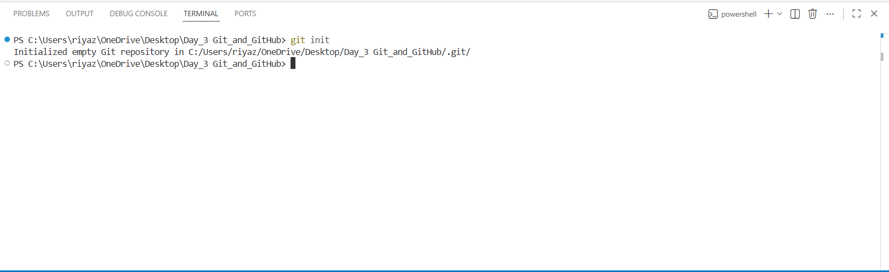
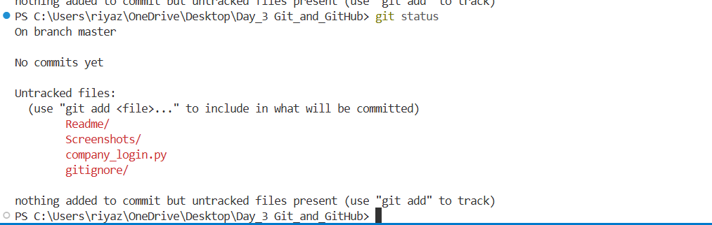

# Day 3 Git & GitHub

## Topics Covered
- Git Basics
- GitHub
- Branching
- Pull Requests
- Merge Conflicts
- .gitignore

## Overview

### Git Basics
- git init
- git status
- git add
- git commit
- git push
- git pull

### Branching
- Creating branches
- Switching branches
- Merging branches
- Deleting branches

### GitHub Workflow
- Connecting local repo to GitHub
- Pushing code to remote repository
- Pull Requests(PR)

### Additional Topics
- .gitignore
- README.md

### Commands Practiced
 ```bash
 git init
 git status
 git add .
 git commit -m "message"
 git push
 git pull
 git branch
 git switch
 git merge
 git branch -d
 ```

### Files Included
|file name|Description|
|---|---|
|`company_login.py`|Login features example|
|`Company_home.py`|homepage features example|
|`company_features.py`|Additional feature implementation|
|`shop.py`|Merge conflict practice|

### Screenshots Included



```text
project/
│
├── README.md
├── app.py
└── Screenshots/
```